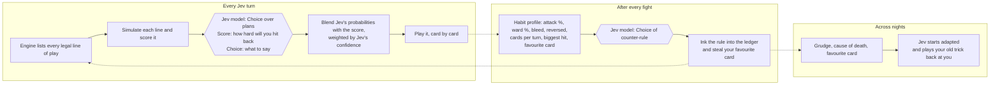

# Hollow Hand

**A night of cards against Jev, a masked Dealer who watches how you play and rewrites its own rules to beat you.**

Occult-tarot roguelike deckbuilder. Every card, mask and trinket is hand-drawn SVG in a woodcut style. Cards drawn upside-down turn into their reversed selves. The opponent's decisions come from TypeSafe's **Jev** model, and between fights it studies your habits and writes counter-rules into its ledger.

**Play it:** https://hollow-hand.vercel.app


<sub>Longer cut with the whole fight: [docs/media/demo.mp4](docs/media/demo.mp4) (36 s).</sub>

---

## What it looks like

| | |
|---|---|
|  |  |
| **Title.** Jev greets you differently depending on how your last night ended. | **The map.** A branching spread of fights, events, the Pawnbroker, candles, one elite and the boss. |
|  |  |
| **The table.** Jev's hand lies face-down with intent sigils; its ledger sits on the left. | **Hover** lifts and tilts a card, with foil glare and a keyword panel. |
|  |  |
| **Jev thinks.** The eyes glow while the model weighs every legal line of play. | **Jev plays** real cards from its own deck, and taunts you about your habits. |
|  |  |
| **The ledger scene.** What Jev saw, the rule it wrote to punish it, and the card it stole. | **Back on the map**, Jev's ledger and stolen tricks follow you. |
|  |  |
| **Events** with dice-rolled outcomes. | **The Pawnbroker**: cards, trinkets, card removal. Paid in teeth. |

### The deck


Reversed cards hang upside-down and bruise violet:


More in [docs/SCREENSHOTS.md](docs/SCREENSHOTS.md). Full card list: [docs/CARDS.md](docs/CARDS.md).

---

## How Jev learns



Code owns the rules. Jev only picks among options the engine has already checked, so it can never make an illegal move, and a winning line is always taken. Without a key, the same pipeline runs on a local heuristic ("instinct") and the top bar reads *Jev: dreaming*. Details: [docs/JEV.md](docs/JEV.md).

---

## Features

- **Reversed cards.** Each draw has a 20% chance to land upside-down: stronger effect, always with a price.
- **RNG you can see.** Dice cards, a Wheel of Fortune, masks that lie about their intent (The Moon), random events.
- **Jev adapts inside a fight too.** Its plan scoring leans on your recorded habits. Heavy Ward players see more piercing and Ward-breaking lines.
- **Story.** Six masks with their own quirks and lines, events with choices, and endings that remember you.
- **Juice.** Trauma-based screen shake, hit-stop, ink and blood splatter that stains the table, Ward that shatters like glass, cards burning to ash, crit flashes with a chromatic split, a cracking mask, and a heartbeat at low HP. All sound is synthesised live in WebAudio.
- **Accessible.** A juice slider, `prefers-reduced-motion` support, keyboard play (`1`–`9` select, `Enter` play, `E` end turn) and a tooltip on every keyword.

---

## Run it locally

```bash
npm install
npm run dev
```

Open http://localhost:5173. Add `?gallery` to jump to the card gallery.

| Script | What it does |
|---|---|
| `npm run dev` | Vite dev server with the Jev bridge mounted at `/api/jev/*` |
| `npm test` | Engine, AI and bridge tests (vitest) |
| `npm run build` | Typecheck + production bundle |
| `npm start` | Build, then serve `dist/` plus the bridge on :4173 |
| `npm run capture` | Re-shoot every screenshot and the demo frames (needs `npm run dev` running) |
| `npm run encode-demo` | Encode the frames into `docs/media/demo.mp4` and `demo.gif` |
| `node scripts/balance.ts` | Headless balance sim: a greedy bot against every mask |
| `node scripts/gen-cards-doc.ts` | Regenerate `docs/CARDS.md` from the game data |

## Give Jev its brain (TypeSafe key)

The key is only ever read on the server (`api/jev.ts`). It is never bundled into or sent to the browser.

**Locally:** put it in `.env.local` (git-ignored) and restart `npm run dev`:

```
TYPESAFE_API_KEY=your-key-here
```

**On Vercel:** add it as a project environment variable, then redeploy:

```bash
vercel env add TYPESAFE_API_KEY production
```

```bash
vercel deploy --prod
```

Check it worked: https://hollow-hand.vercel.app/api/jev/status should return `"ready": true`, and in game the tag should read *Jev: awake*, with Jev's speech showing `Jev · N% sure`.

---

## Docs

- [docs/JEV.md](docs/JEV.md): the AI in detail. Plan enumeration, the exact questions sent to the model, blending, evolution, fallbacks.
- [docs/DESIGN.md](docs/DESIGN.md): rules, turn structure, statuses, map, economy, balance targets.
- [docs/CARDS.md](docs/CARDS.md): every card, mask, ledger rule and trinket (generated).
- [docs/ART.md](docs/ART.md): how the cards are drawn and framed, the palette, motion.
- [docs/DEVELOPMENT.md](docs/DEVELOPMENT.md): architecture, file map, testing, capture pipeline, deploy.
- [docs/DEVLOG.md](docs/DEVLOG.md): how it was built, decisions and numbers along the way.

## Stack

Vite + TypeScript, no UI framework. The DOM and CSS draw the cards, one pooled canvas draws the particles, the Web Animations API runs the tweens, and WebAudio makes the sound. The Jev bridge is a single Web-standard handler that runs as a Vercel function and as local middleware. Fonts are IM Fell English and Pirata One via Fontsource.
