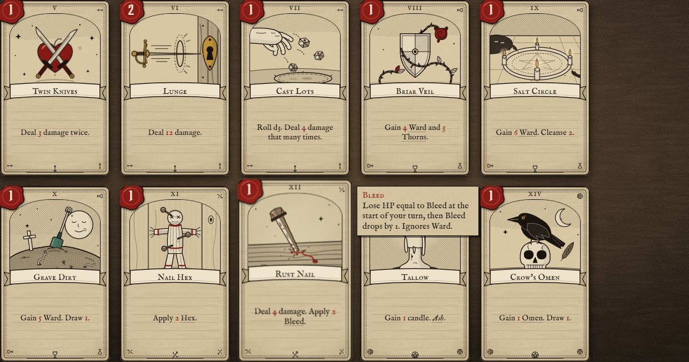
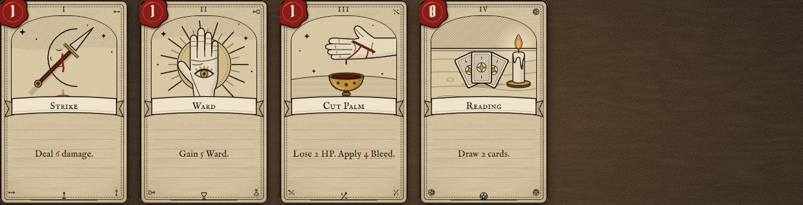
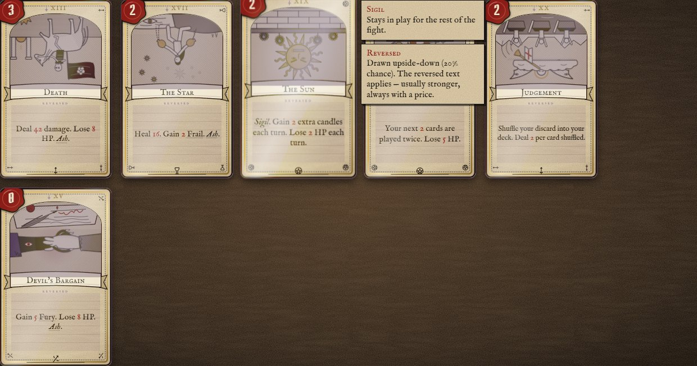
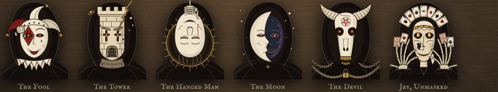

# Art

Nothing in the game is a raster image or an emoji. Every card illustration, mask, trinket, icon, card back and frame is SVG written by hand in TypeScript. The brief the illustrators worked from is [src/art/STYLE.md](../src/art/STYLE.md).

## Direction

The look is woodcut and engraved tarot, in the line of 15th-century block prints and the Rider–Waite deck, with a slightly uncanny twist. The moon on Strike is asleep. The palm on Ward has an eye. The Bone Chapel's windows are the eyes of a skull.

- **Ink first.** The lines are bold (1.2–2px, round joins) and the shading is hatch patterns, never gradients.
- **One accent per image.** Blood, gold or verdigris carries the eye; everything else is ink on parchment.
- **One subject.** Each image has one silhouette that reads at 120px wide, plus one or two supporting symbols.

### Palette (`src/art/palette.ts`)

| Token | Hex | Use |
|---|---|---|
| INK | `#1b1410` | linework |
| PARCH / BONE | `#e3d3b0` / `#efe4cb` | ground, highlights |
| BLOOD | `#8a1c17` | the main accent, costs, damage |
| GOLD | `#c79a3e` | rares, halos, crits |
| VERD | `#4a7a68` | uncommons, tarnish |
| VIOLET | `#4b3354` | reversed, curses |
| LACQUER | `#120c0b` | Jev's cards |

### Shared defs (`src/art/defs.ts`)

These are injected once into the document, so every inline SVG can reference them:

- **Hatch patterns:** `hh-hatch`, `-d`, `-r`, `-v`, `-h`, cross-hatch, stipple, and bone, blood and gold variants.
- **Gradients:** gold, flame, glow, night, lacquer.
- **Filters:** a soft glow for flames and eyes.

## The frame (`src/ui/cardView.ts`, `src/styles/card.css`)

Each card is built at a 5:8 ratio and scales with CSS container units, so it stays crisp at any size:

- aged parchment (SVG turbulence noise and fibres) with a burnt edge;
- a double woodcut border with suit glyphs in the corners;
- a **wax-seal cost** (dark red wax for Toll cards, with "HP");
- the roman numeral at the top and an **arched art window**;
- the title on a curled **ribbon**, with long names shrunk to fit;
- rules text on a **ruled vellum** panel, where keywords are underlined and get a tooltip panel on hover.

The suit follows the card's job. **Blades** attack, **Chalices** defend and heal, **Coins** handle candles, draw and chaos, and **Wands** carry curses and statuses.

| Rarity | Treatment |
|---|---|
| Starter / common | iron ink border |
| Uncommon | verdigris inner border |
| Rare | gold-leaf border and an animated foil sheen that follows the tilt |
| Jev | black lacquer, red rules, gold numerals |
| Curse | bruised violet paper |

**Reversed** cards turn only the art upside-down, tarot-style, with a violet multiply wash, a glow around the card and a "reversed" tag. The text stays upright so you can read it.

## Motion

Art groups opt into CSS animation by class: `a-flicker` (flames), `a-blink`, `a-drip`, `a-spin`, `a-spin-slow` (the Wheel), `a-smoke`, `a-float`, `a-pulse`, `a-sway` (the Hanged Man, bells, hooks) and `a-glint`. Each uses `transform-box: fill-box` so it pivots on itself. All of it stops under `prefers-reduced-motion`.

## Masks

Masks are 240×280 with a required structure the combat screen drives:

- `m-eyes` glow red while Jev decides;
- `m-mouth` moves when Jev speaks;
- `crack-1`, `crack-2` and `crack-3` appear at 75%, 50% and 25% HP.

## Credits

The frame, icons, card back and the reference piece (*Strike*) were drawn first. The remaining illustrations were drawn in four parallel batches against the brief: player commons, the major arcana, Jev's cards, and masks with trinkets. Each batch was checked for balanced markup and palette-only colours, and reviewed in the gallery (`?gallery`).
